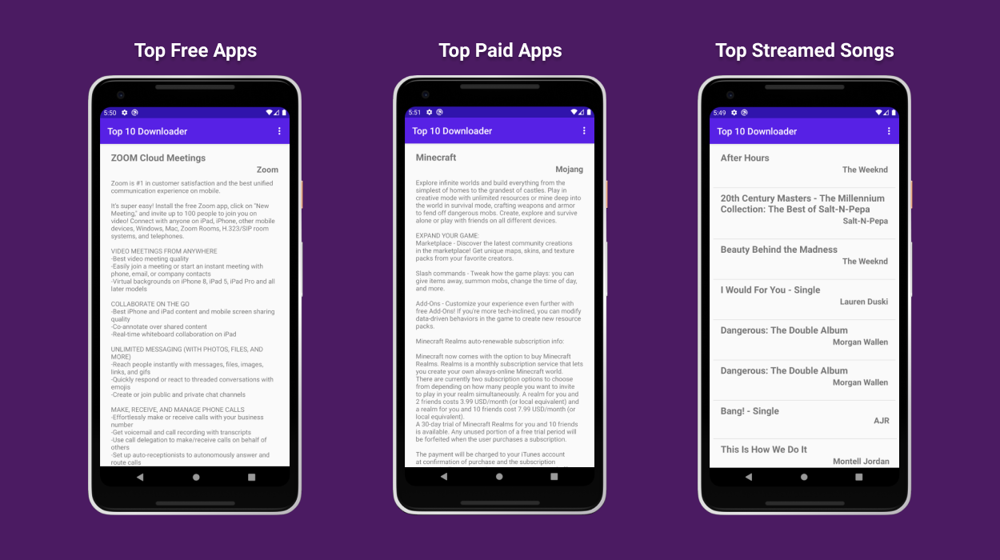

# Android-Top-10-Downloaded-Apps
Project Name: Android Top 10 Downloaded Apps  
Project Date: June 2020  
Technologies Used: Java, Android Studio  
Project Description:
Displays top categories in Free Apps, Paid Apps, and Most Streamed Songs on the
Apple Appstore, home to over 1.4 billion users.

## Features

* Open Source
* Parses XML Data and Displays Accordingly
* Filter Through Multiple Categories
* Efficiently Optimized For Small App Size

## Table of Contents
1. [ScreenShots](#screenshots)
2. [Installation](#installation)

## Screenshots

## Installation (Run Locally)

1. [AndroidStudio](https://developer.android.com/studio) required

2. Install and Setup AndroidStudio

3. Download Code / Clone Repository

4. Open Android Studio and click Open Existing Project and navigate and select folder from previous step

5. Tools -> AVD and Set up a Android Virtual Device

6. Click Green Arrow to Run App and Select AVD from previous step

7. Enjoy!

## Suggestions
Open to any suggestions and help provided.
